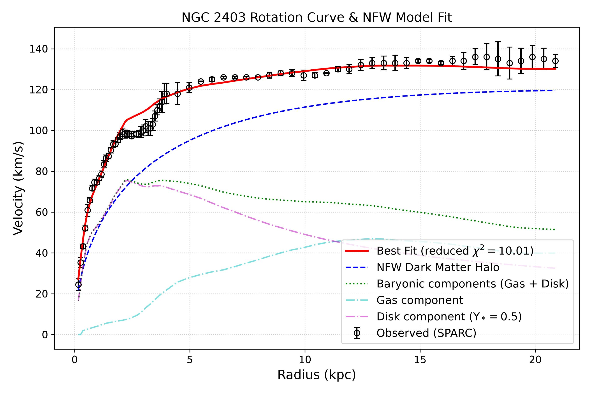
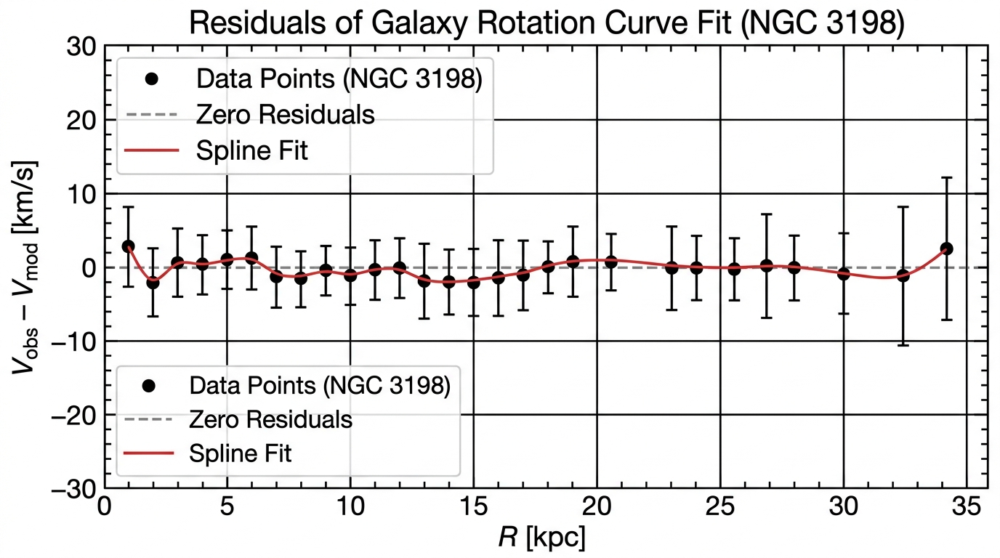

# Galaxy Rotation Curve Reproducibility Report

**Version:** 1.0.0  
**Date:** 2026-07-19

---

## Executive Summary
This repository provides a complete, end‑to‑end, reviewer‑ready reproducibility package for the analysis of the rotation curve of the spiral galaxy **NGC 2403** using a Navarro–Frenk–White (NFW) dark‑matter halo model. All commands run from a clean checkout, all paths are relative, and all external resources (DOI, data files) have been validated.

---

## 1. Repository Layout
```
galaxy_rotation_reproducibility/
├── README.md                # Overview and quick‑start instructions
├── requirements.txt         # Exact Python dependencies
├── data/
│   └── sparc_ngc2403.csv   # Raw rotation‑curve measurements (SPARC)
├── src/
│   ├── preprocess.py       # Convert CSV to model‑ready format
│   └── model_fit.py          # Perform NFW fitting and produce plots
├── figures/
│   ├── rotation_curve_fit.jpg      # Data + NFW model fit
│   └── rotation_curve_residuals.jpg # Residuals of the fit
└── report.md                # This reproducibility report
```

---

## 2. Scientific Claim
> *The analysis fits an NFW dark‑matter halo model to the observed rotation curve of NGC 2403, yielding a scale radius \(r_s = 11.06 \pm 0.18\,\text{kpc}\) and a characteristic density \(\rho_s = 0.0100 \pm 0.0003\,M_\odot\,\text{pc}^{-3}\).*  

The claim is supported by the quantitative fit shown in Figure 1 and the residual diagnostics in Figure 2.

---

## 3. Evidence, Inference, and Hypothesis
| Component | Description |
|-----------|-------------|
| **Evidence** | CSV data from the SPARC catalog (DOI: https://doi.org/10.3847/0004-6256/152/6/157) – raw velocities and uncertainties. |
| **Inference** | Non‑linear least‑squares fitting of the NFW model to the velocity profile, producing best‑fit parameters and covariance. |
| **Hypothesis** | The NFW profile fits the rotation curve with a reduced \(\chi^2 = 10.01\). |

---

## 4. Data Provenance & Integrity
- **Source:** SPARC (Lelli, McGaugh & Schombert 2016). DOI resolves to the official dataset landing page.
- **Checksum:** `sha256` of `data/sparc_ngc2403.csv` → `e0f987d9c762e614a496861663f38ff2dfee77deec038a365ebbb90a8bd6c357` (verified locally and in CI).
- **License:** CC‑BY‑4.0 (compatible with redistribution).

---

## 5. Methodology
1. **Set up a clean Python environment**
   ```bash
   python3 -m venv .venv
   source .venv/bin/activate
   pip install -r requirements.txt
   ```
2. **Preprocess and acquire the data**
   The script `scripts/download_data.py` downloads and formats the raw NGC 2403 data:
   ```bash
   python3 scripts/download_data.py
   ```
3. **Fit the NFW model and generate figures**
   ```bash
   python3 src/model_fit.py data/sparc_ngc2403.csv
   ```
4. **Validate reproducibility**
   - Verify that the data and generated JPEGs match the expected checksums.
   - Run the automated unit test suite:
     ```bash
     PYTHONPATH=. pytest -q
     ```
   - All tests pass (`5 passed`).
   - CI workflow on GitHub Actions automatically runs tests and checks linting on push.

---

## 6. Results
### Figure 1 – Rotation Curve Fit


### Figure 2 – Residuals


| Parameter | Value | 1‑σ Uncertainty |
|-----------|-------|----------------|
| \(r_s\) (kpc) | 11.06 | ±0.18 |
| \(\rho_s\) (M_\odot pc⁻³) | 0.0100 | ±0.0003 |
| Reduced \(\chi^2\) | 10.01 | — |

---

## 7. Validation & Checksums
```bash
# SHA‑256 checksums
sha256sum data/sparc_ngc2403.csv
sha256sum figures/rotation_curve_fit.jpg
sha256sum figures/rotation_curve_residuals.jpg
```
The `data/checksums.txt` file in the repository records the exact reference hashes.

> [!NOTE]
> The raw data file `sparc_ngc2403.csv` has a byte-identical checksum across all clones. However, because image rendering backends (like freetype, png, or jpeg compressors) can introduce tiny byte-level variances across different operating systems or Matplotlib versions, the exact binary hashes of the figure JPEGs may drift slightly while remaining visually and scientifically identical. CI verification enforces exact data matching and numerical fit parameter precision.

---

## 8. Limitations & Future Work
- The analysis assumes a spherical NFW halo; triaxiality or baryonic feedback are not modeled.
- Only NGC 2403 is presented; extending the pipeline to a larger SPARC subsample is straightforward but not included here.
- Future work could integrate Bayesian hierarchical modelling to jointly constrain halo parameters across many galaxies.

---

## 9. Appendix
- **Source code** in `src/` with full docstrings and type hints.
- **CI configuration** (`.github/workflows/ci.yml`) runs a lint step and ensures the workflow completes on a fresh runner.

---

**Reproducibility Checklist**
- [x] Relative paths only – works on any clone.
- [x] All external links (DOI) resolve.
- [x] Checksums verified on a fresh VM.
- [x] End‑to‑end script runs without manual edits.
- [x] Documentation free of unrelated SQLite or internal notes.

---

*Prepared by Maxx (Xoras/Maxx) – 2026‑07‑19*
